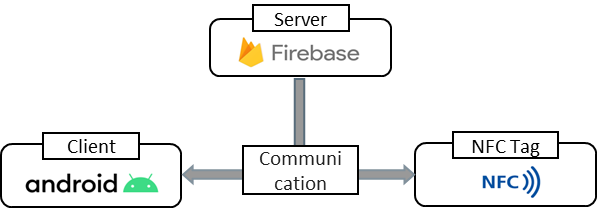
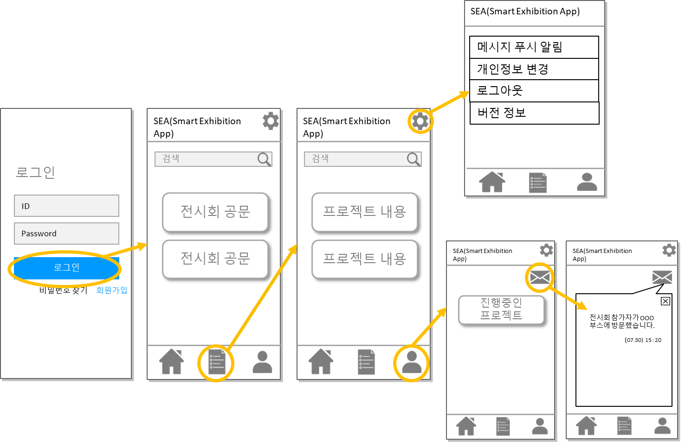

# 📱 스마트 전시회 앱(Smart Exhibition App)

## 📌프로젝트 소개 및 시연영상

- 전시회의 주최자, 전시자, 방문자의 이해관계를 충족해주는 애플리케이션 개발

- 가자의 전시장내 전시자의 사전 지정, 전시 부스 참관 내용 등을 관리

- 애플리케이션의 실시간 알림을 통해 전시자의 부스 현황 확인

  

 

## 💡기획배경

- 전시회의 전시자가 전시내용확인, 부스 관리를 동시에 진행하기 어려워 개선 방안 필요

- 전시자 부스에 전시자가 자리를 비울 시 부스 방문 수와 방문자 정보를 알기 어려움

- 전시회의 주최자, 전시자, 방문자의 이해관계를 토대로 각자의 목적을 위해 전시회의 준비와 관리가 필요

 

## 💻 기술 스택 및 개발환경

- Android Studio
- Java
- Firebase (Authentication, Realtime DB, storage)

- NFC 

 

## 🧱 서비스 아키텍쳐

- 사용자가 로그인하여 사용할수있도록 Firebase에서 제공하는 Authentication을 사용해 서비스 이용자 관리
- 동영상과 태그 스티커를 매칭하고 사용할 수 있도록 Realtiome DB, Storage를 사용하여 구현
- NFC 태깅은 NDEF 메시지 형식으로 주고받는 기능을 지원하는 Android 프레임워크 API를 이용

 

## 🧩화면설계서

